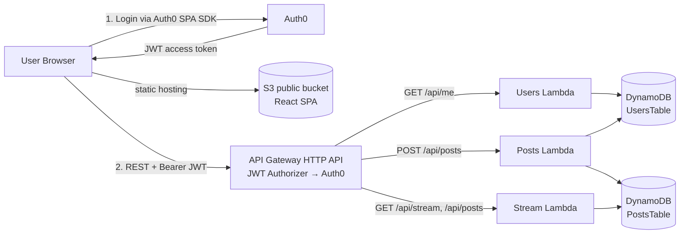
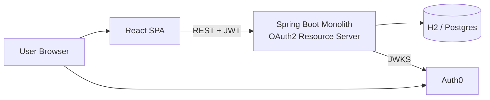

# 🐦 Chirp — Secure Twitter-like App (Monolith → Microservices + Auth0)

Assignment for the **Microservices and Modern Architectures (AREM)** course at *Escuela Colombiana de Ingeniería Julio Garavito*.

A simplified Twitter-like application where authenticated users publish short posts (≤ 140 characters) into a single global public stream. The project evolves from a **Spring Boot 3 monolith** into **three serverless microservices on AWS Lambda**, with the frontend hosted as a static site on **Amazon S3**. All protected endpoints are secured with **Auth0** JWT access tokens.

---

## Table of contents

1. [Final architecture](#final-architecture)
2. [Architecture evolution](#architecture-evolution)
3. [Repository layout](#repository-layout)
4. [REST API](#rest-api)
5. [Auth0 setup](#auth0-setup)
6. [Local development](#local-development)
7. [Deployment to AWS](#deployment-to-aws)
8. [Testing report](#testing-report)
9. [Live links](#live-links)
10. [Video demo](#video-demo)
11. [Team](#team)

---

## Final architecture




Full diagrams and narrative: [`docs/architecture.md`](docs/architecture.md).

### Components

| Layer | Tech | Purpose |
|---|---|---|
| Frontend | React 18 + Vite + @auth0/auth0-react | SPA with login/logout, post form, stream feed |
| Static hosting | Amazon S3 website | Publicly accessible distribution of the SPA bundle |
| Identity / AuthN | Auth0 (SPA + API) | OIDC login; issues JWT access tokens with audience |
| Monolith (phase 1) | Spring Boot 3.5 + OAuth2 Resource Server | Single app validating JWTs, serving Swagger UI |
| Microservices (phase 2) | 3× AWS Lambda (Node.js 20) | Users, Posts, Stream services |
| API Gateway | AWS API Gateway HTTP API + JWT Authorizer | Routes requests, validates JWT at the edge |
| Storage | DynamoDB (`UsersTable`, `PostsTable`) | Per-service tables, pay-per-request |

---

## Architecture evolution

### Phase 1 — Monolith



A single Spring Boot application exposes all endpoints (`/api/posts`, `/api/stream`, `/api/me`) and validates JWT tokens via Auth0’s issuer URI. Great for a first iteration: one deploy, one database, no inter-service plumbing. Swagger UI at `/swagger-ui.html`.

### Phase 2 — Serverless microservices

We split the monolith along natural seams:
- **Users service** owns the user table (profile upsert from JWT claims, serves `/api/me`).
- **Posts service** handles the protected write path (`POST /api/posts`), validating content length.
- **Stream service** handles the public read path (`GET /api/stream`, `GET /api/posts`) — the cheapest, most-hit path gets its own scalable Lambda without JWT overhead.

API Gateway performs JWT validation against Auth0 **before** invoking any protected Lambda — token validation becomes declarative (SAM template) rather than code. Each Lambda has an IAM role that only lets it touch the DynamoDB tables it needs.

---

## Repository layout

```
.
├── monolith/              # Spring Boot 3.5 monolith (phase 1)
│   ├── src/
│   ├── pom.xml
│   └── .env.example
├── frontend/              # React + Vite SPA
│   ├── src/
│   ├── index.html
│   ├── vite.config.js
│   ├── package.json
│   └── .env.example
├── microservices/         # Phase 2 — SAM + 3 Lambdas
│   ├── users-service/
│   ├── posts-service/
│   ├── stream-service/
│   ├── template.yaml
│   └── samconfig.toml.example
├── docs/
│   └── architecture.md    # Mermaid diagrams + narrative
├── .gitignore
└── README.md
```

---

## REST API

All endpoints accept and return `application/json`. Protected endpoints require
`Authorization: Bearer <JWT>` where the JWT is an Auth0 access token whose audience
matches the configured API identifier.

| Method | Path | Auth | Description |
|---|---|---|---|
| `GET` | `/api/posts?page=0&size=20` | Public | Paged list of posts, newest first |
| `GET` | `/api/stream?page=0&size=20` | Public | Same as above — single global stream |
| `POST` | `/api/posts` | **JWT required** | Create a post (content ≤ 140 chars) |
| `GET` | `/api/me` | **JWT required** | Current user profile (upserted from JWT claims) |

Complete OpenAPI 3 specification is auto-generated by `springdoc-openapi`. When
the monolith is running locally:

- Swagger UI → <http://localhost:8080/swagger-ui.html>
- Raw JSON spec → <http://localhost:8080/v3/api-docs>

**Example request:**

```bash
# Public
curl http://localhost:8080/api/stream

# Protected (get token from Auth0 or from the SPA console)
curl -X POST http://localhost:8080/api/posts \
  -H "Authorization: Bearer $ACCESS_TOKEN" \
  -H "Content-Type: application/json" \
  -d '{"content":"Hello from curl!"}'
```

---

## Auth0 setup

You need a free Auth0 account at <https://auth0.com/signup>.

### 1. Create a Single Page Application

Dashboard → **Applications → Applications → Create Application** → *Single Page Web Applications*.

In the application settings:

- **Allowed Callback URLs**: `http://localhost:5173, https://<YOUR-S3-URL>`
- **Allowed Logout URLs**: `http://localhost:5173, https://<YOUR-S3-URL>`
- **Allowed Web Origins**: `http://localhost:5173, https://<YOUR-S3-URL>`

Note the **Domain** and **Client ID** — you will put them in `frontend/.env`.

### 2. Create an API

Dashboard → **Applications → APIs → Create API**.

- **Name**: `Twitter API`
- **Identifier** (Audience): e.g. `https://twitter-api.example.com` — this is a logical identifier, it does **not** need to resolve to a real URL.
- **Signing Algorithm**: `RS256`

(Recommended) Add permissions/scopes: `read:posts`, `write:posts`, `read:profile`.

### 3. Fill in the environment files

```bash
# monolith/.env
AUTH0_ISSUER_URI=https://YOUR-TENANT.us.auth0.com/
AUTH0_AUDIENCE=https://twitter-api.YOUR-DOMAIN
CORS_ALLOWED_ORIGINS=http://localhost:5173

# frontend/.env
VITE_AUTH0_DOMAIN=YOUR-TENANT.us.auth0.com
VITE_AUTH0_CLIENT_ID=YOUR_SPA_CLIENT_ID
VITE_AUTH0_AUDIENCE=https://twitter-api.YOUR-DOMAIN
VITE_API_BASE_URL=http://localhost:8080
```

> 🚨 Never commit real Auth0 values or AWS credentials. Both files are listed in `.gitignore`.

---

## Local development

### Prerequisites

| Tool | Version used |
|---|---|
| Java | 21 |
| Maven | 3.9+ |
| Node.js | 20+ |
| npm | 10+ |
| AWS CLI | v2 |
| SAM CLI | 1.100+ |

### Run the monolith

```bash
cd monolith
cp .env.example .env         # fill with your Auth0 values
export $(grep -v '^#' .env | xargs)
mvn spring-boot:run
```

The app starts on <http://localhost:8080>. Open the Swagger UI at
<http://localhost:8080/swagger-ui.html>. H2 console (dev only) at
<http://localhost:8080/h2-console> (JDBC URL `jdbc:h2:mem:twitterdb`).

### Run the frontend

```bash
cd frontend
cp .env.example .env         # fill with your Auth0 SPA values
npm install
npm run dev
```

Visit <http://localhost:5173>.

---

## Deployment to AWS

### 1. Microservices (Lambda + API Gateway + DynamoDB)

```bash
cd microservices
# install deps for each function (Lambda packages only production deps)
(cd users-service && npm install --omit=dev)
(cd posts-service && npm install --omit=dev)
(cd stream-service && npm install --omit=dev)

cp samconfig.toml.example samconfig.toml   # fill in Auth0 values
sam build
sam deploy --guided    # first time only; subsequent deploys just: sam deploy
```

Capture the output `ApiUrl` — that is the base URL the frontend will call.

### 2. Frontend on Amazon S3

```bash
cd frontend
# Point to the deployed API Gateway URL
echo "VITE_API_BASE_URL=https://<api-id>.execute-api.us-east-1.amazonaws.com" >> .env
npm run build

# Create the bucket (bucket names are globally unique)
BUCKET=chirp-frontend-<your-unique-suffix>
aws s3 mb s3://$BUCKET --region us-east-1
aws s3 website s3://$BUCKET --index-document index.html --error-document index.html

# Upload the build
aws s3 sync dist/ s3://$BUCKET --delete

# Allow public read (for a bare S3 website). For production use CloudFront + OAC.
aws s3api put-public-access-block --bucket $BUCKET \
  --public-access-block-configuration "BlockPublicAcls=false,IgnorePublicAcls=false,BlockPublicPolicy=false,RestrictPublicBuckets=false"

aws s3api put-bucket-policy --bucket $BUCKET --policy "{
  \"Version\": \"2012-10-17\",
  \"Statement\": [{
    \"Sid\": \"PublicReadGetObject\",
    \"Effect\": \"Allow\",
    \"Principal\": \"*\",
    \"Action\": \"s3:GetObject\",
    \"Resource\": \"arn:aws:s3:::$BUCKET/*\"
  }]
}"

echo "http://$BUCKET.s3-website-us-east-1.amazonaws.com"
```

Then **back in Auth0**, add `http://$BUCKET.s3-website-us-east-1.amazonaws.com` to *Allowed Callback URLs*, *Allowed Logout URLs*, and *Allowed Web Origins*.

---

## Testing report

### Monolith — unit/web-layer tests

```
$ cd monolith && mvn test

[INFO] Tests run: 4, Failures: 0, Errors: 0, Skipped: 0
[INFO] BUILD SUCCESS
```

The `PostControllerTest` uses `@WebMvcTest` to exercise the web layer without
spinning up the full context (no real Auth0 issuer contacted). Scenarios covered:

| # | Scenario | Expected | Actual |
|---|---|---|---|
| 1 | `GET /api/posts` without JWT | `200 OK` | ✅ |
| 2 | `POST /api/posts` without JWT | `401 Unauthorized` | ✅ |
| 3 | `POST /api/posts` with valid JWT | `201 Created` | ✅ |
| 4 | `POST /api/posts` with 141-char content | `400 Bad Request` | ✅ |

### Manual end-to-end test matrix

Perform these steps after deploying the monolith (or microservices) and the frontend:

| # | Action | Expected result |
|---|---|---|
| 1 | Open the SPA unauthenticated | Stream is visible, no post form shown |
| 2 | Click **Log in** → complete Auth0 Universal Login | Redirected back, username shown |
| 3 | Verify `GET /api/me` in DevTools network tab | `200 OK` with your profile |
| 4 | Submit a post of `> 140` chars | Submit button disabled; counter turns red |
| 5 | Submit a valid post | `201 Created`, post appears at the top of the stream |
| 6 | Manually `POST /api/posts` without `Authorization` (curl) | `401 Unauthorized` |
| 7 | Manually `POST /api/posts` with a JWT from a different audience | `401 Unauthorized` (audience validation) |
| 8 | Click **Log out** | Cleared session, post form disappears |

### Frontend build

```
$ cd frontend && npm run build
✓ 38 modules transformed.
✓ built in 641ms
```

---

## Live links

Fill these in once deployed:

- 🌐 **Frontend (S3 website)**: `http://<YOUR-BUCKET>.s3-website-us-east-1.amazonaws.com`
- 📖 **Swagger UI (monolith, if still deployed)**: `http://<YOUR-MONOLITH-HOST>/swagger-ui.html`
- ⚡ **API Gateway (microservices)**: `https://<api-id>.execute-api.us-east-1.amazonaws.com`

An exported snapshot of the OpenAPI 3 spec lives at [`docs/openapi.json`](docs/openapi.json) (generated by hitting `/v3/api-docs` on the running monolith and saving the output).

---

## Video demo

TODO: record 5–8 min walk-through showing:

1. Login via Auth0 redirect.
2. `GET /api/me` returning user profile.
3. Creating a post and seeing it appear in the stream.
4. Attempting an unauthenticated `POST` and seeing `401`.
5. Brief tour of the Swagger UI, SAM template, and the S3-hosted SPA.

---

## Important notes

- **Auth0 is mandatory** and used end-to-end. No local auth fallback.
- **Swagger / OpenAPI** is mandatory for the monolith phase — available at
  `/swagger-ui.html` with JWT security scheme documented.
- **No credentials are committed** to git. `.env`, `samconfig.toml`, and
  everything under `.aws-sam/` are gitignored. Environment variables carry
  all Auth0 / AWS config.
- Error handling returns structured JSON (see `GlobalExceptionHandler` in the
  monolith; each Lambda returns a JSON body with `error` on failure).

---

## Team

- Álvaro Baena — <alvaro@baena.cc> — [@DSBAENAR](https://github.com/DSBAENAR)

Escuela Colombiana de Ingeniería Julio Garavito · AREM · 2026-1.
