# Chirp — Secure Twitter-like App (Monolith → Microservices + Auth0)

Assignment for the **Microservices and Modern Architectures (AREM)** course at *Escuela Colombiana de Ingeniería Julio Garavito*.

A simplified Twitter-like application where authenticated users publish short posts (≤ 140 characters) into a single global public stream. The project evolves from a **Spring Boot 3 monolith** into **three serverless microservices on AWS Lambda + API Gateway + DynamoDB**, with the React SPA hosted on **Vercel** (HTTPS). All protected endpoints are secured with **Auth0** JWT access tokens.

---

## Table of contents

1. [Live links](#live-links)
2. [Final architecture](#final-architecture)
3. [Architecture evolution](#architecture-evolution)
4. [Repository layout](#repository-layout)
5. [REST API](#rest-api)
6. [Auth0 setup](#auth0-setup)
7. [Local development](#local-development)
8. [Deployment to AWS](#deployment-to-aws)
9. [Testing report](#testing-report)
10. [Evidence gallery](#evidence-gallery)
11. [Video demo](#video-demo)
12. [Team](#team)

---

## Live links

| Resource | URL |
|---|---|
| Frontend (Vercel, HTTPS) | <https://chirp-frontend-pi.vercel.app> |
| API Gateway (microservices) | <https://u3yvt8psjk.execute-api.us-east-1.amazonaws.com> |
| Public stream (test endpoint) | <https://u3yvt8psjk.execute-api.us-east-1.amazonaws.com/api/stream> |
| Swagger UI (monolith, local) | <http://localhost:8080/swagger-ui.html> |
| S3 website (legacy, HTTP only) | <http://chirp-frontend-715145332694.s3-website-us-east-1.amazonaws.com> |

> **Why Vercel and not S3 + CloudFront?**
> Auth0's SPA SDK (`auth0-spa-js`) refuses to run on insecure origins (HTTP), and AWS Academy **Learner Lab** blocks CloudFront (`cloudfront:*` is denied for the sandboxed `voclabs` role). The S3 bucket was created and kept as evidence of the intended production path — in a real AWS account it would be served through CloudFront with an ACM certificate. Vercel is used as a CDN/HTTPS front-end equivalent so Auth0 can actually issue tokens during grading.

---

## Final architecture

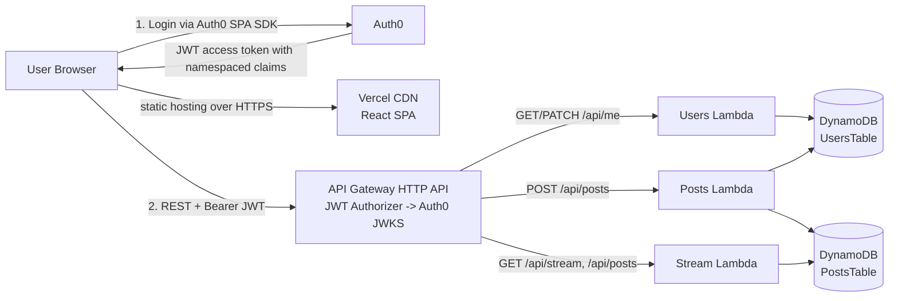

Full diagrams and narrative: [`docs/architecture.md`](docs/architecture.md).

### Components

| Layer | Tech | Purpose |
|---|---|---|
| Frontend | React 18 + Vite + `@auth0/auth0-react` + `lucide-react` | SPA with login/logout, username onboarding modal, post form, stream |
| CDN / HTTPS | Vercel | Global edge delivery with automatic HTTPS; required because Auth0 rejects HTTP origins |
| Static storage (evidence) | Amazon S3 website | Shows the intended AWS-native hosting path (HTTP only in Learner Lab) |
| Identity / AuthN | Auth0 (SPA + API + Post-Login Action) | OIDC login; issues JWTs with namespaced profile claims (`https://chirp.baena.cc/*`) |
| Monolith (phase 1) | Spring Boot 3.5 + OAuth2 Resource Server + Lombok + springdoc 2.8 | Single app validating JWTs, H2 in-memory DB, Swagger UI |
| Microservices (phase 2) | 3× AWS Lambda (Node.js 20, arm64) | Users, Posts, Stream services |
| API Gateway | AWS API Gateway HTTP API + JWT Authorizer | Routes requests, validates JWT + audience at the edge |
| Storage | DynamoDB (`UsersTable`, `PostsTable`) | On-demand, single-digit-ms reads |
| IAM | Pre-created `LabRole` (Learner Lab constraint) | Lambda execution role; the sandbox forbids creating new IAM roles |

---

## Architecture evolution

### Phase 1 — Monolith


A single Spring Boot application exposes all endpoints (`/api/posts`, `/api/stream`, `/api/me`) and validates JWT tokens via Auth0's issuer URI. One deploy, one database, no inter-service plumbing. Swagger UI at `/swagger-ui.html`.

### Phase 2 — Serverless microservices

The monolith is split along natural seams:
- **Users service** owns the user table (profile upsert from JWT claims, `GET` / `PATCH /api/me`).
- **Posts service** handles the protected write path (`POST /api/posts`), validating content length.
- **Stream service** handles the public read path (`GET /api/stream`, `GET /api/posts`) — the cheapest, most-hit path gets its own scalable Lambda without JWT overhead.

API Gateway performs JWT validation against Auth0 **before** invoking any protected Lambda — token validation becomes declarative (SAM template) rather than code. Each Lambda shares the Learner Lab `LabRole` so no new IAM roles need to be created in the sandbox.

---

## Repository layout

```
.
├── monolith/              # Spring Boot 3.5 monolith (phase 1)
│   ├── src/
│   ├── pom.xml
│   └── .env.example
├── frontend/              # React + Vite SPA (deployed to Vercel)
│   ├── src/
│   ├── index.html
│   ├── vite.config.js
│   ├── package.json
│   └── .env.example
├── microservices/         # Phase 2 — SAM + 3 Lambdas
│   ├── users-service/
│   ├── posts-service/
│   ├── stream-service/
│   ├── template.yaml
│   └── samconfig.toml.example
├── docs/
│   └── architecture.md    # Mermaid diagrams + narrative
├── .gitignore
└── README.md
```

---

## REST API

All endpoints accept and return `application/json`. Protected endpoints require `Authorization: Bearer <JWT>` where the JWT is an Auth0 access token whose audience matches the configured API identifier.

| Method | Path | Auth | Description |
|---|---|---|---|
| `GET` | `/api/posts?page=0&size=20` | Public | Paged list of posts, newest first |
| `GET` | `/api/stream?page=0&size=20` | Public | Same as above — single global stream |
| `POST` | `/api/posts` | **JWT required** | Create a post (content ≤ 140 chars) |
| `GET` | `/api/me` | **JWT required** | Current user profile (upserted from JWT claims) |
| `PATCH` | `/api/me` | **JWT required** | Update the user's chosen username (3–30 chars, `[A-Za-z0-9_]`); also sets `onboarded=true` |

### User onboarding flow

1. On first login the frontend calls `GET /api/me`. The backend upserts a user row from the JWT claims with `onboarded=false` and a best-effort username (nickname → name → email local-part → `user-<hash>`).
2. Because `onboarded` is false, the SPA shows a modal asking the user to pick / confirm their handle.
3. The modal submits `PATCH /api/me` with the chosen username, which also marks `onboarded=true`.
4. Subsequent logins skip the modal.

Complete OpenAPI 3 specification is auto-generated by `springdoc-openapi`. When the monolith is running locally:

- Swagger UI → <http://localhost:8080/swagger-ui.html>
- Raw JSON spec → <http://localhost:8080/v3/api-docs>

**Example request:**

```bash
# Public
curl http://localhost:8080/api/stream

# Protected — obtain token from the SPA (Auth0 dev tools)
curl -X POST http://localhost:8080/api/posts \
  -H "Authorization: Bearer $ACCESS_TOKEN" \
  -H "Content-Type: application/json" \
  -d '{"content":"Hello from curl!"}'
```

---

## Auth0 setup

A free Auth0 account is required: <https://auth0.com/signup>.

### 1. Create a Single Page Application

Dashboard → **Applications → Applications → Create Application** → *Single Page Web Applications*.

- **Allowed Callback URLs**: `http://localhost:5173, https://chirp-frontend-pi.vercel.app`
- **Allowed Logout URLs**: `http://localhost:5173, https://chirp-frontend-pi.vercel.app`
- **Allowed Web Origins**: `http://localhost:5173, https://chirp-frontend-pi.vercel.app`

Copy the **Domain** and **Client ID** into `frontend/.env`.

### 2. Create an API

Dashboard → **Applications → APIs → Create API**.

- **Name**: `Twitter API`
- **Identifier** (Audience): e.g. `https://twitter-api.example.com` (logical identifier, does not need to resolve)
- **Signing Algorithm**: `RS256`

Recommended scopes: `read:posts`, `write:posts`, `read:profile`.

### 3. Post-Login Action (inject profile claims into the access token)

Auth0 access tokens only carry `sub` by default. The app needs `email`, `name`, `nickname`, and `picture` so the avatar and default username can be resolved without hitting `/userinfo`.

Dashboard → **Actions → Triggers → post-login → + (Add Action) → Build from scratch**.

```js
exports.onExecutePostLogin = async (event, api) => {
  const namespace = 'https://chirp.baena.cc/';
  if (event.authorization) {
    if (event.user.email)    api.accessToken.setCustomClaim(`${namespace}email`, event.user.email);
    if (event.user.name)     api.accessToken.setCustomClaim(`${namespace}name`, event.user.name);
    if (event.user.nickname) api.accessToken.setCustomClaim(`${namespace}nickname`, event.user.nickname);
    if (event.user.picture)  api.accessToken.setCustomClaim(`${namespace}picture`, event.user.picture);
  }
};
```

**Deploy → Apply** it to the Login flow. Both the monolith and the `users-service` Lambda read those claims with a plain→namespaced fallback helper.

### 4. Fill in the environment files

```bash
# monolith/.env
AUTH0_ISSUER_URI=https://YOUR-TENANT.us.auth0.com/
AUTH0_AUDIENCE=https://twitter-api.YOUR-DOMAIN
CORS_ALLOWED_ORIGINS=http://localhost:5173,https://chirp-frontend-pi.vercel.app

# frontend/.env
VITE_AUTH0_DOMAIN=YOUR-TENANT.us.auth0.com
VITE_AUTH0_CLIENT_ID=YOUR_SPA_CLIENT_ID
VITE_AUTH0_AUDIENCE=https://twitter-api.YOUR-DOMAIN
VITE_API_BASE_URL=https://<api-id>.execute-api.us-east-1.amazonaws.com
```

> Never commit real Auth0 values or AWS credentials. Both files are listed in `.gitignore`.

---

## Local development

### Prerequisites

| Tool | Version used |
|---|---|
| Java | 21 |
| Maven | 3.9+ |
| Node.js | 20+ |
| npm | 10+ |
| AWS CLI | v2 |
| SAM CLI | 1.157+ |
| Vercel CLI | 50+ (only for frontend deploys) |

### Run the monolith

```bash
cd monolith
cp .env.example .env         # fill with your Auth0 values
set -a && source .env && set +a
mvn spring-boot:run
```

The app starts on <http://localhost:8080>. Open the Swagger UI at <http://localhost:8080/swagger-ui.html>. H2 console (dev only) at <http://localhost:8080/h2-console> (JDBC URL `jdbc:h2:mem:twitterdb`).

### Run the frontend

```bash
cd frontend
cp .env.example .env         # fill with your Auth0 SPA values
npm install
npm run dev
```

Visit <http://localhost:5173>.

---

## Deployment to AWS

### 1. Microservices (Lambda + API Gateway + DynamoDB)

```bash
cd microservices
(cd users-service && npm install --omit=dev)
(cd posts-service && npm install --omit=dev)
(cd stream-service && npm install --omit=dev)

cp samconfig.toml.example samconfig.toml   # fill in Auth0 values + LabRole ARN
sam build
sam deploy
```

**Learner Lab note:** the stack uses a `LambdaExecutionRoleArn` parameter that must point at `arn:aws:iam::<ACCOUNT_ID>:role/LabRole` because the sandbox forbids creating new IAM roles. See `microservices/samconfig.toml.example`.

The stack output `ApiUrl` is the base URL for `VITE_API_BASE_URL`. For this deployment:

```
https://u3yvt8psjk.execute-api.us-east-1.amazonaws.com
```

### 2. Frontend on Vercel (HTTPS)

```bash
cd frontend
# Point to the deployed API Gateway URL
echo "VITE_API_BASE_URL=https://<api-id>.execute-api.us-east-1.amazonaws.com" > .env
npm run build

# Deploy the pre-built dist/
cd dist && vercel deploy --prod --yes --name chirp-frontend
```

Vercel returns a production URL such as `https://chirp-frontend-pi.vercel.app`. Add it to Auth0's *Allowed Callback URLs / Logout URLs / Web Origins*, and redeploy SAM with `CorsAllowedOrigin` set to that URL so API Gateway CORS allows browser calls.

### 3. Frontend on S3 (evidence only — does not run in Learner Lab)

```bash
BUCKET=chirp-frontend-$(aws sts get-caller-identity --query Account --output text)
aws s3api create-bucket --bucket $BUCKET --region us-east-1
aws s3api put-public-access-block --bucket $BUCKET \
  --public-access-block-configuration "BlockPublicAcls=false,IgnorePublicAcls=false,BlockPublicPolicy=false,RestrictPublicBuckets=false"
aws s3 website s3://$BUCKET --index-document index.html --error-document index.html
aws s3api put-bucket-policy --bucket $BUCKET --policy "{
  \"Version\":\"2012-10-17\",
  \"Statement\":[{\"Sid\":\"PublicReadGetObject\",\"Effect\":\"Allow\",\"Principal\":\"*\",\"Action\":\"s3:GetObject\",\"Resource\":\"arn:aws:s3:::$BUCKET/*\"}]
}"
aws s3 sync dist/ s3://$BUCKET --delete
echo "http://$BUCKET.s3-website-us-east-1.amazonaws.com"
```

The bucket URL is served over **HTTP only**. In a real AWS account you would put CloudFront + ACM in front (`OriginProtocolPolicy: http-only`, `ViewerProtocolPolicy: redirect-to-https`). Learner Lab denies `cloudfront:*`, which is why production traffic routes through Vercel instead.

---

## Testing report

### Monolith — unit/web-layer tests

```
$ cd monolith && mvn test

[INFO] Tests run: 4, Failures: 0, Errors: 0, Skipped: 0
[INFO] BUILD SUCCESS
```

`PostControllerTest` uses `@WebMvcTest` with a `@MockitoBean JwtDecoder` so the full Spring context is not loaded and no real Auth0 issuer is contacted. Scenarios covered:

| # | Scenario | Expected | Actual |
|---|---|---|---|
| 1 | `GET /api/posts` without JWT | `200 OK` | pass |
| 2 | `POST /api/posts` without JWT | `401 Unauthorized` | pass |
| 3 | `POST /api/posts` with valid JWT | `201 Created` | pass |
| 4 | `POST /api/posts` with 141-char content | `400 Bad Request` | pass |

### Manual end-to-end matrix

| # | Action | Expected result |
|---|---|---|
| 1 | Open the SPA unauthenticated | Stream is visible, no post form shown |
| 2 | Click **Log in** → complete Auth0 Universal Login | Redirected back, onboarding modal appears |
| 3 | Submit username in the modal (`PATCH /api/me`) | Modal closes, header shows the new handle |
| 4 | `GET /api/me` in DevTools network tab | `200 OK` with `onboarded: true` |
| 5 | Submit a post of `> 140` chars | Submit button disabled, counter turns red |
| 6 | Submit a valid post | `201 Created`, post appears at the top of the stream |
| 7 | Curl `POST /api/posts` with no `Authorization` header | `401 Unauthorized` at the API Gateway JWT authorizer |
| 8 | Curl `POST /api/posts` with a JWT from a different audience | `401 Unauthorized` (audience validation) |
| 9 | Click **Log out** | Session cleared, post form disappears |

### Frontend build

```
$ cd frontend && npm run build
vite v5.4.21 building for production...
✓ 1746 modules transformed.
dist/assets/index-*.js   ≈ 334 kB │ gzip: 102 kB
✓ built in ~1 s
```

---

## Evidence gallery

Screenshots captured during the final end-to-end run against the deployed stack.

### Infrastructure (CloudFormation / API Gateway / DynamoDB)

| | |
|---|---|
| 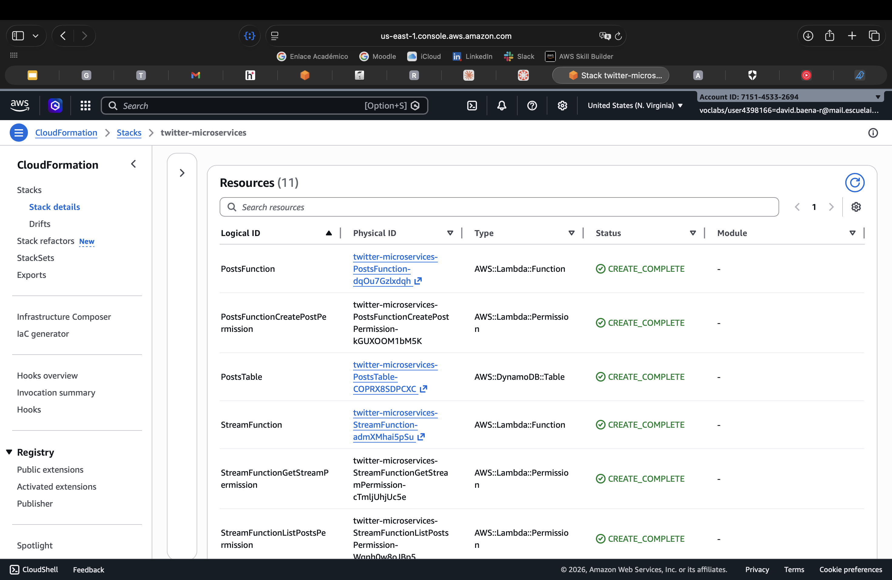 | 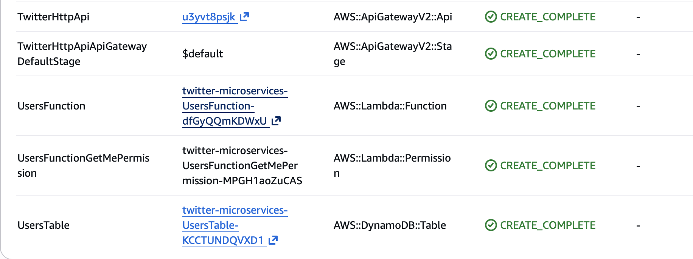 |
| CloudFormation — the SAM stack creates 11 resources end-to-end | Functions, permissions, `UsersTable` all `CREATE_COMPLETE` |
| 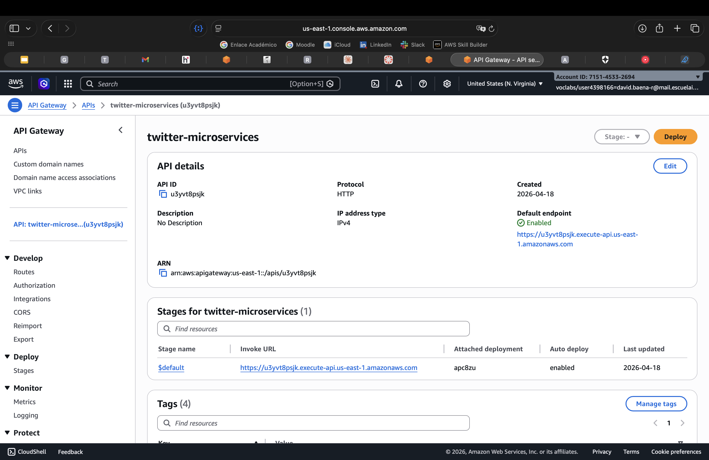 | 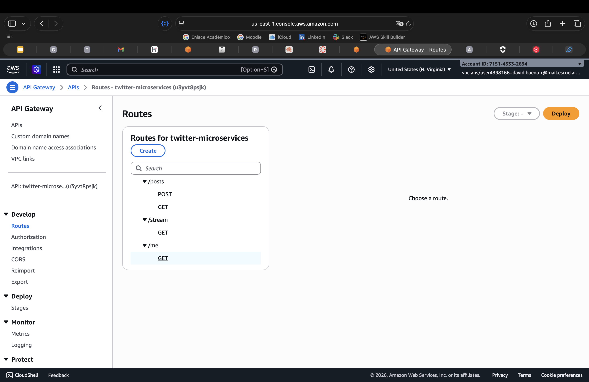 |
| HTTP API `twitter-microservices` with invoke URL and stage | Routes: `POST/GET /api/posts`, `GET /api/stream`, `GET/PATCH /api/me` |

### Storage (DynamoDB)

| Empty (post-deploy) | With data (after using the app) |
|---|---|
| 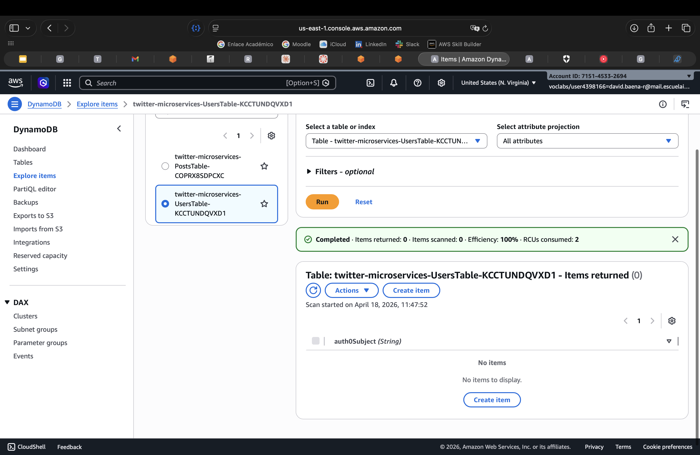 | 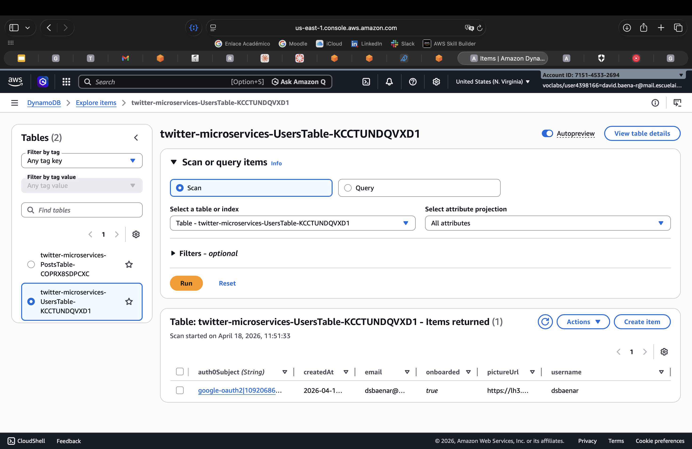 |
| 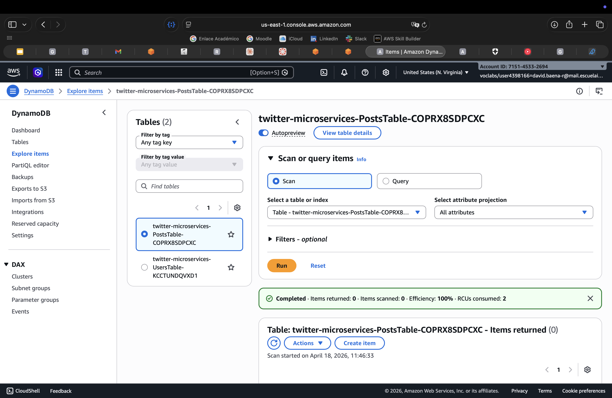 | 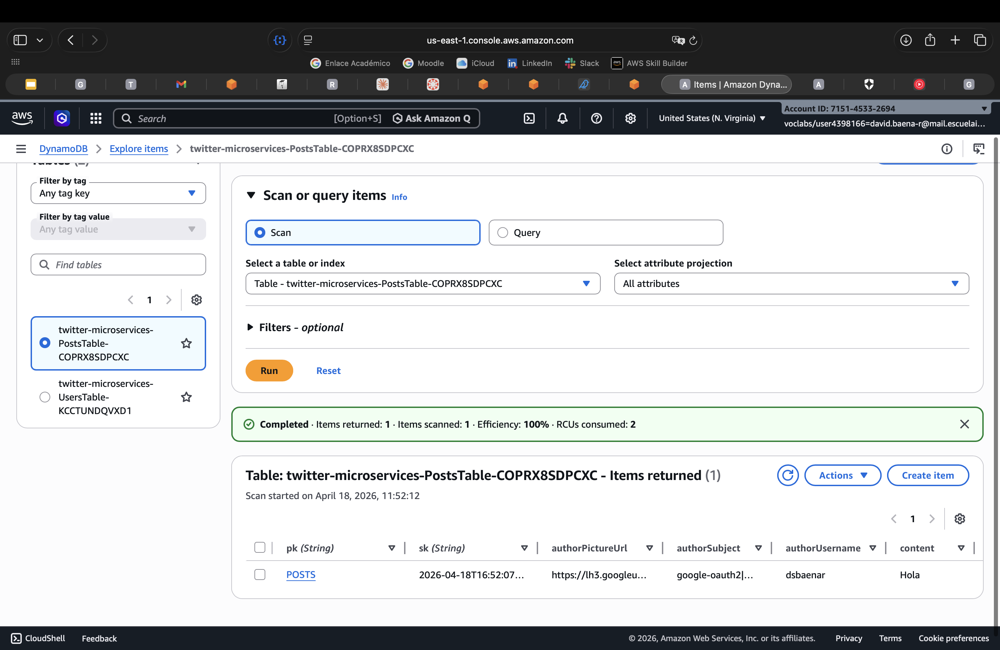 |

### Auth0 login flow

| Universal Login | Google account chooser |
|---|---|
| 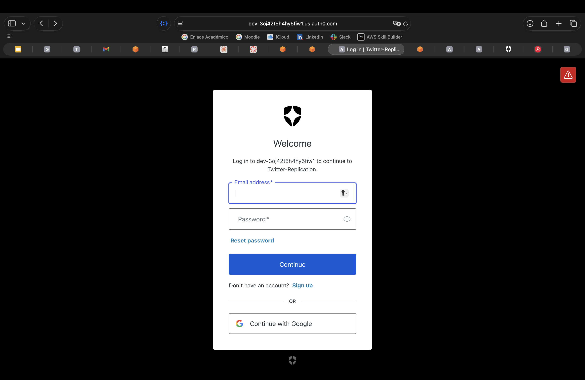 | 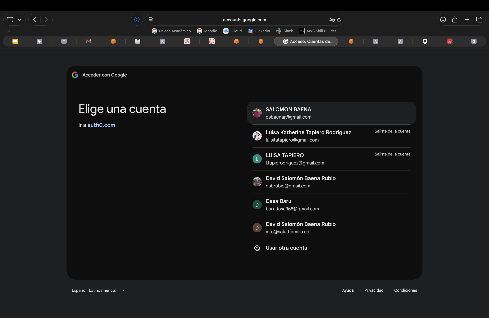 |

### Frontend (Vercel + S3 evidence)

| S3 bucket (artifacts) | SPA on Vercel, logged in |
|---|---|
| 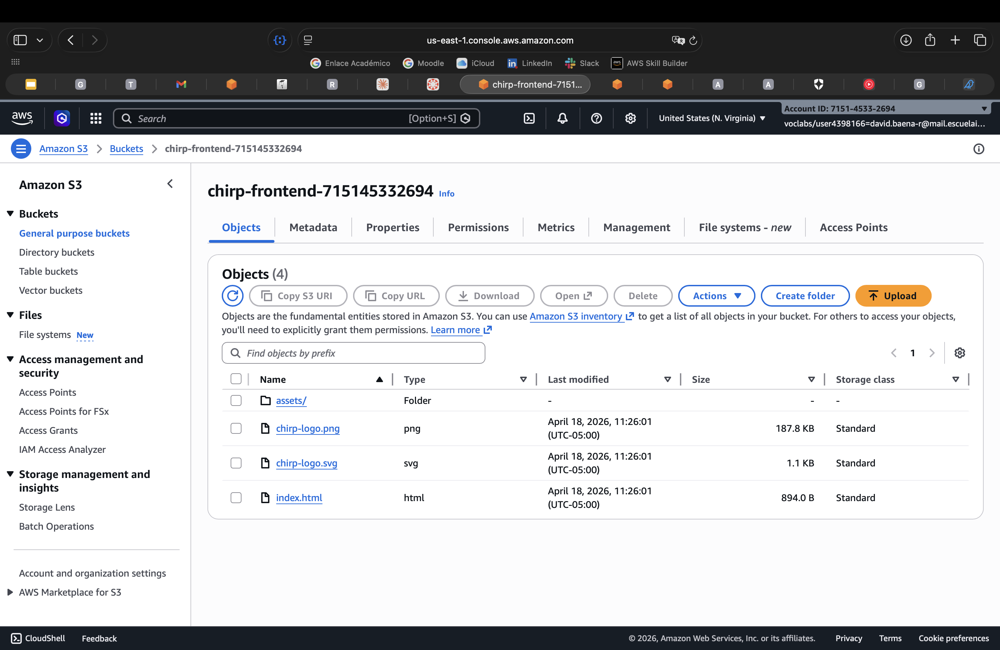 | 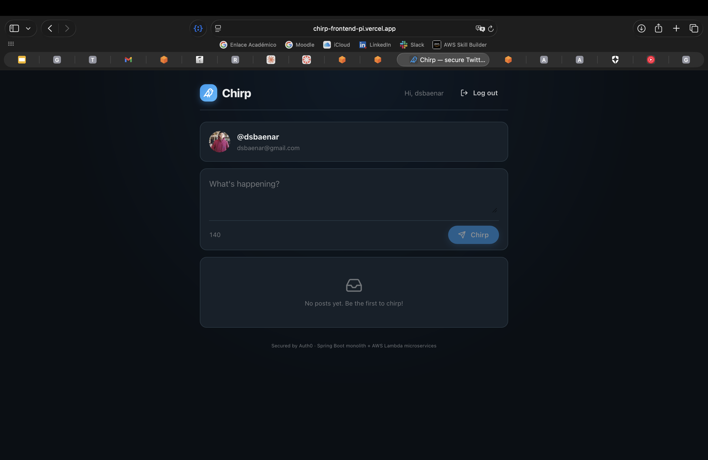 |

| Stream endpoint returning `[]` | Post published, visible in the stream |
|---|---|
| 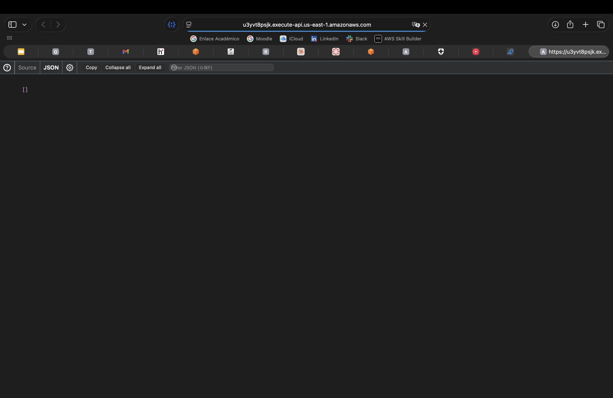 | 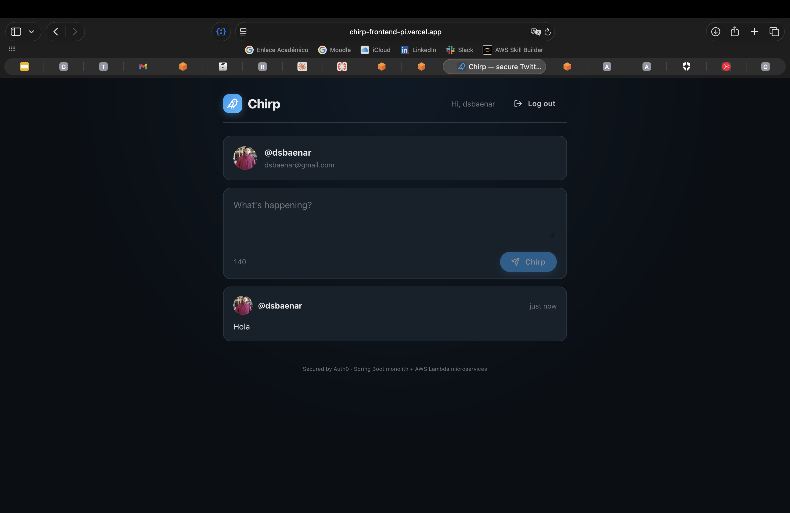 |

---

## Video demo

### Monolith

[Download the monolith demo video](https://github.com/DSBAENAR/microservices-twitter-auth0/raw/main/monolito.mov)

<video src="https://github.com/DSBAENAR/microservices-twitter-auth0/raw/main/monolito.mov" controls width="720"></video>

### Microservices

[Download the microservices demo video](https://github.com/DSBAENAR/microservices-twitter-auth0/raw/main/microservicios.mov)

<video src="https://github.com/DSBAENAR/microservices-twitter-auth0/raw/main/microservicios.mov" controls width="720"></video>

Target length: 5–8 min.

1. Repo + README tour; explain the refactor goal.
2. Monolith running locally: Swagger UI, `GET /api/stream`, `GET /api/me` with a valid JWT.
3. Refactor walkthrough: show `template.yaml`, the three Lambdas, the JWT authorizer.
4. AWS console: CloudFormation stack, Lambda functions, API Gateway routes, DynamoDB tables.
5. Live SPA on Vercel: login → onboarding modal → create post → public stream updates.
6. `401` demo: curl without a token against `POST /api/posts`.
7. Brief note on the S3 bucket as evidence of the intended S3 + CloudFront path, and the Learner Lab CloudFront constraint.

---

## Important notes

- **Auth0 is mandatory** and used end-to-end (SPA SDK on the frontend, Resource Server in the monolith, HTTP API JWT authorizer in the microservices). No local auth fallback.
- **Swagger / OpenAPI** is mandatory for the monolith phase — available at `/swagger-ui.html` with the JWT security scheme documented.
- **No credentials are committed** to git. `.env`, `samconfig.toml`, and `.aws-sam/` are gitignored; Learner Lab credentials live in a root-level `.env` also ignored.
- **Learner Lab constraints** shape two deployment choices:
  - Lambdas use a pre-existing `LabRole` (no IAM role creation allowed).
  - The SPA is served through Vercel because CloudFront is denied, and Auth0 refuses HTTP origins.
- Error handling returns structured JSON (see `GlobalExceptionHandler` in the monolith; each Lambda returns a JSON body with `error` on failure).

---

## Team

—David Salomón Baena Rubio [@DSBAENAR](https://github.com/DSBAENAR)

Escuela Colombiana de Ingeniería Julio Garavito · AREM · 2026-1.
