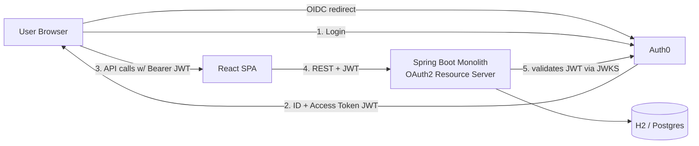
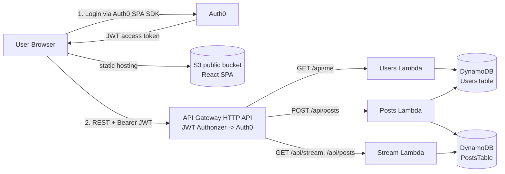
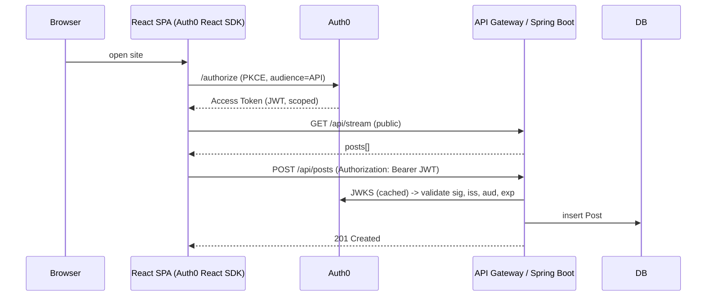

# Architecture

## Phase 1 — Spring Boot monolith

- Single Spring Boot app exposing `/api/posts`, `/api/stream`, `/api/me`.
- All endpoints share one process, one datasource, one deployment.
- Swagger UI at `/swagger-ui.html` documents the OpenAPI spec.

## Phase 2 — Serverless microservices

- API Gateway validates JWT before invoking any protected Lambda — the Lambda never needs to verify the signature.
- Three independent services, each with its own deployment unit and IAM scope.
- DynamoDB tables are private to their owning services (Users table is read/written by Users and Posts services only; Stream is read-only).

## Security flow

## Why three microservices?

- **Users**: isolates identity concerns (user profile, upsert on first login). Can later add avatar upload, preferences, etc.
- **Posts**: write path for the protected `POST /api/posts`. Enforces the 140-char rule and writes to the posts table.
- **Stream**: read path for the public feed. Pure DynamoDB query, no JWT validation — cheap and horizontally scalable.

This split matches natural read/write separation and allows the stream service to scale independently of writes (which are rarer).
